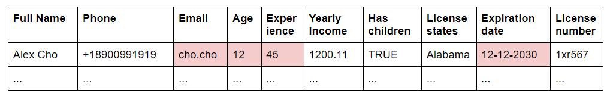
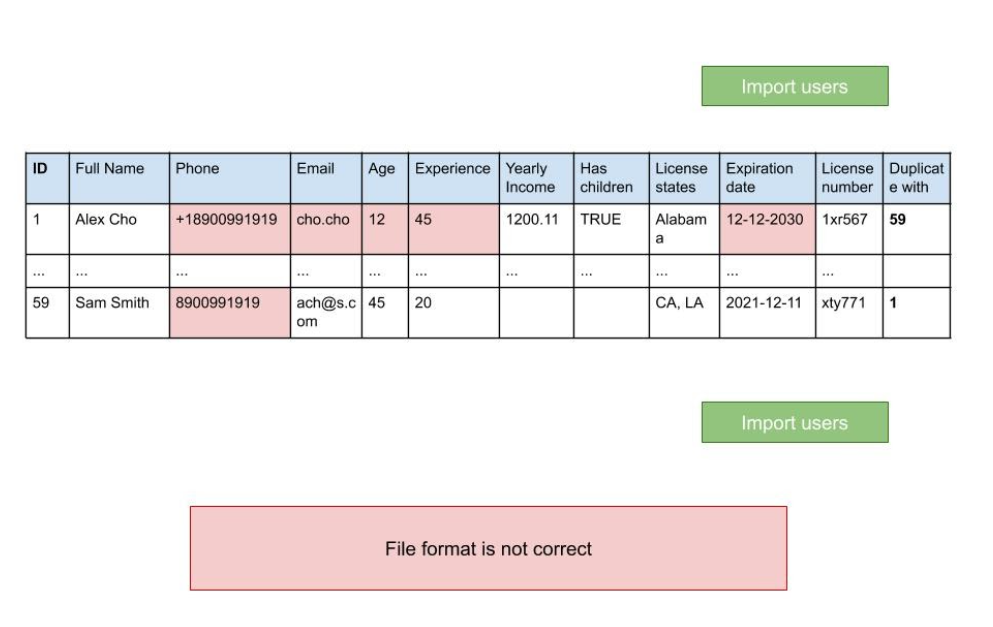

# React Load and Validate Csv File
- [DEMO LINK](https://dmytromykoliv.github.io/react_task_csv-file/)

# Description

 **Context**: Your company is recruiting lawyers. You have a prepared csv file, which contains employee data in the following format:

 

 You need to import the data and display it in the table. If the data is filled in incorrectly - the corresponding cell should be highlighted in red.

 ___

 ### Validation rules:
1. Data can have a space before or after the text, so it should be ignored.
1. Email and Phone must be unique within the file. AlexCho@cho.com is the same as alexCHO@CHO.coM. The Duplicate with column should show the ID of the first row found, which duplicates the current email / phone.
1. Age - must be of type integer. Not less than 21 years.
1. Experience - greater than or equal to 0 (not more than current Age - 21)
1. Yearly income - can be of type integer or decimal, but always displayed with two decimal places. Not more than 1 million
1. All numeric values ​​must be> = 0 (depending on the field - age cannot be 0)
1. License states - can be abbreviated or have a full name (AL, Alabama). However, they are displayed only in a short format. There can be several values, separated by a vertical line | .
1. Expiration date - can be accepted in two formats (YYYY-MM-DD or MM / DD / YYYY). Everything else is a mistake. Cannot be less than the current date.
1. Phone - should be displayed in the format + 1xxxxxxxxxx (ten characters after +1). However, you can import in the following formats: + 1хххххххххх, 1хххххххххх, хххххххххх
1. Has children - is accepted as TRUE / FALSE values. An empty cell is accepted as FALSE. Everything else is a mistake.
1. License number - 6 characters consisting of numbers or text characters.
1. Full Name / Phone / Email - are required fields. If one of them is not present - instead of the table it is necessary to show the message that the file is not correct. Show the same message if the file format is not csv. If the title name has another case - full Name, the field is considered valid.

 

___
## Local development

### Dependencies
* Node v12.16.3 and higher
* NPM v6.14.4 and higher

### Installing
* Fork and clone this repository
* Run `npm install` in your terminal
* Run `npm start`
___

# Troubleshooting
Any advise for common problems or issues. For any contributing or problem solving you could find me [telegram](https://t.me/AmigoDelUA) and [email](dmytro.i.mykoliv@gmail.com)
